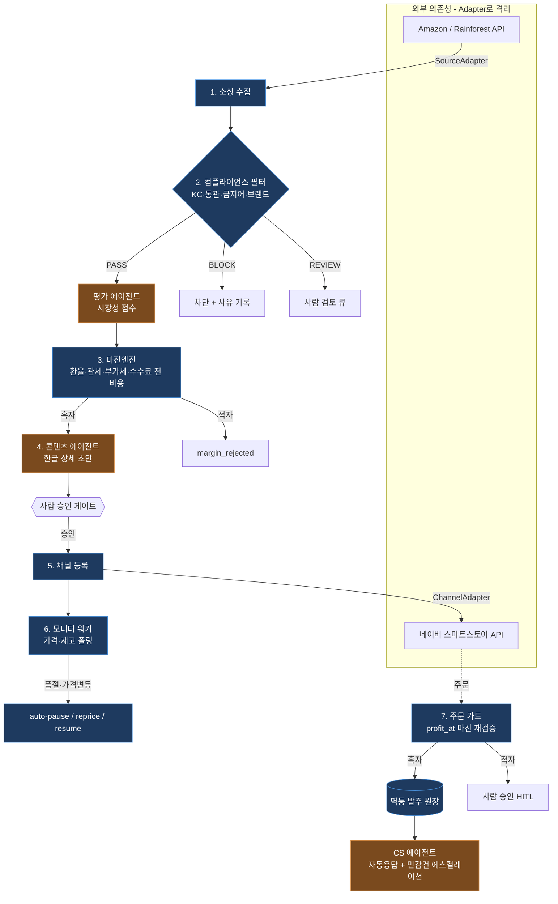

# 직구곰 (jikgugom) — 해외 구매대행 자동화 플랫폼

> 🐻 Amazon 인기상품을 소싱 → 통관·인증 규제 필터 → 전 비용 마진계산 → 한글 상세페이지 → 네이버 등록 → 반자동 발주 → 가격·재고 모니터링까지 한 줄로 자동화하는 **무재고(드롭십) 플랫폼**.

핵심 설계 철학 한 줄: **돈이 직접 오가는 구간은 결정론 코드, 애매한 판단(시장성·CS)만 LLM 에이전트.**

---

## 🎬 데모

<!-- TODO: 실측값 채우기 — 대시보드 동작 GIF / 스크린샷 / 배포 링크 -->
🚧 **데모 GIF·스크린샷 추가 필요** (어드민 대시보드 승인 버튼·발주 큐·시장성 점수 화면)

키 없이 즉시 전체 흐름을 보고 싶으면 [실행방법](#-실행방법) → `python -m jikgugom.demo` 한 줄로 mock 파이프라인이 돈다.

---

## 🎯 왜 만들었나 (문제 정의)

해외 구매대행은 **잘못 등록하면 곧바로 돈·법적 사고**로 이어진다.

- **적자 매입** — 환율·관세·부가세·수수료를 빼먹고 가격을 매기면 팔수록 손해.
- **통관 불가 / 인증 누락** — KC인증·금지 품목·짝퉁을 거르지 못하면 통관 거절·판매 정지.
- **이중 발주** — 같은 주문이 두 번 발주되면 그대로 이중 매입.
- **벤더 종속** — Amazon·네이버 API가 언제든 바뀌거나 자격 요건이 강화될 수 있다.

그래서 **신뢰 경계를 "돈/규제"에 긋고**, 그 구간은 전부 결정론 코드로 확정한다. LLM은 환각이 손실로 직결되지 않는 정성 판단(시장성 평가·콘텐츠 초안·CS 응대)만 맡는다.

---

## 🛠️ 기술 스택 + 선정 이유

| 분류 | 기술 | 선정 이유 |
|---|---|---|
| Language | Python 3 | AI 에이전트 + 데이터 파이프라인 표준 생태계 |
| Backend / API | **FastAPI** + Uvicorn | 비동기 ASGI, 타입 기반 스키마 검증으로 대시보드 API를 빠르게 노출 |
| Persistence | **SQLAlchemy 2.0** (SQLite→PostgreSQL) | `Repository` 인터페이스 뒤에 두어 인메모리↔SQL을 코드 변경 없이 교체 |
| Scheduler | APScheduler | 별도 인프라 없이 인프로세스로 가격·재고 주기 점검 |
| LLM Agent | Claude (Anthropic) | 시장성/콘텐츠/CS 같은 정성 판단 (키 없으면 자동 mock) |
| 번역 | DeepL | 상세페이지 본문 번역 (LLM과 하이브리드) |
| Frontend | Next.js 16 / React 19 | 어드민 대시보드 (승인 버튼·발주 큐) |
| 외부 연동 | Rainforest API(Amazon) · 네이버 커머스 API | 1차 타깃. Adapter 뒤에 가둬 교체 가능 |
| Test | pytest | 결정론 엔진·어댑터 계약 검증 |

> **왜 SQLAlchemy를 Repository 뒤에 숨겼나** — 포트폴리오 단계는 SQLite, 운영은 PostgreSQL. 비즈니스 로직이 ORM에 직접 의존하면 교체가 불가능해서, 저장소 접근을 추상 인터페이스로 가뒀다.

---

## 🏗️ 시스템 아키텍처

돈/규제 구간(파란 흐름)은 결정론, 판단 구간(주황)만 에이전트. 외부 의존성은 모두 Adapter/Repository로 격리한다.



**구현 현황** — 위 7단계 + 어드민 대시보드 + DB 영속화 + 스케줄러까지 모두 구현 완료. 멀티채널 동시등록·예측 ML은 로드맵(Phase 3).

---

## 📊 성능 / 검증 지표

| 지표 | 값 | 비고 |
|---|---|---|
| 자동화 테스트 | **123 passed** (`pytest -q`, 테스트 함수 117 + 파라미터화) | 결정론 엔진·어댑터 계약·발주 멱등성 검증 |
| 테스트 실행 시간 | ~1.5s | 외부 API 의존 없이 fake로 격리 |
| 외부 키 의존도 | 0 (mock 자동 폴백) | 키 없이 전체 파이프라인 실행 가능 |
| 소싱 평균 마진율 / 처리량 | 🚧 측정 필요 | <!-- TODO: 실 API 연동 후 실측 --> |

> 본 프로젝트는 ML 모델 학습이 아닌 **에이전트+결정론 파이프라인**이라, 핵심 지표는 정확도가 아니라 "돈 관련 로직의 테스트 커버리지와 멱등성"이다.

---

## 🔧 트러블슈팅 / 의사결정 기록

**자동화 vs 안전성 — 어디까지 LLM에 맡길까**
- 문제: LLM에 마진 계산을 맡기면 환각 한 번이 그대로 적자 매입.
- 원인: 돈·규제 판단은 "그럴듯함"이 아니라 "정확함"이 필요한 영역.
- 해결: **신뢰 경계를 돈/규제에 긋고** 마진·통관·KC를 전부 결정론 코드로 확정, LLM은 시장성·콘텐츠·CS만 담당.
- 결과: 손실 직결 로직은 100% 테스트 가능한 순수 함수로 분리됨.

**이중 발주 위험 — 네트워크 재시도가 이중 매입으로**
- 문제: 같은 주문이 재시도/중복 이벤트로 두 번 발주될 수 있음.
- 원인: 발주는 외부 결제를 동반하는 비가역 작업.
- 해결: 발주를 **멱등 원장(ledger)** 에 기록해 중복 차단 + 발주 직전 `profit_at` 마진 재검증, 적자면 사람 승인(HITL).
- 결과: 동일 주문 재요청 시에도 발주 1회만 보장 (`test_order_processor`·`test_manual_fulfiller`로 검증).

<details>
<summary>벤더 종속 회피 — Adapter/Repository 추상화 (펼치기)</summary>

- 문제: Amazon PA-API의 "직전 30일 10건 판매" 자격 요건, 채널·DB 교체 가능성.
- 해결: 소스/채널을 `SourceAdapter`·`ChannelAdapter`(ABC, 포트-어댑터 패턴)로, 저장소를 `Repository`로 추상화. 파이프라인은 '구현'이 아니라 '계약'에만 의존.
- 결과: Rainforest→PA-API, 네이버→쿠팡, SQLite→PostgreSQL을 비즈니스 로직 수정 없이 교체 가능. (`test_adapters_contract`로 계약 검증)
</details>

---

## 🚀 실행방법

### 레벨 1 — 키 없이 데모/테스트 (즉시)
```bash
pip install -r requirements.txt
python -m jikgugom.demo      # 샘플 카탈로그로 전체 흐름 1회 실행 (mock)
python -m pytest -q          # 123 passed
```

### 레벨 2 — 어드민 대시보드 (웹 UI)
```bash
# 1) 백엔드 API (터미널 A)
python -m uvicorn api.main:app --port 8000 --reload
# 2) 프론트 (터미널 B)
npm --prefix dashboard install   # 최초 1회
npm --prefix dashboard run dev   # http://localhost:3000
```
상태는 SQLite 파일(`jikgugom.db`)에 영속 — 재시작해도 승인 내역 유지. PostgreSQL 전환:
```bash
export DATABASE_URL=postgresql+psycopg://user:pw@host/db
export MONITOR_INTERVAL_SECONDS=300   # 가격·재고 자동 점검 주기 (0=수동만)
```

### 레벨 3 — 실 API 키로 동작
환경변수만 채우면 mock → real 자동 전환 (없는 키는 mock 유지).
```bash
export RAINFOREST_API_KEY=...   # Amazon 소싱
export NAVER_CLIENT_ID=...      # 네이버 커머스 API (+ pip install bcrypt)
export NAVER_CLIENT_SECRET=...
export ANTHROPIC_API_KEY=...    # 평가/콘텐츠/CS 에이전트 (선택)
export DEEPL_API_KEY=...        # 본문 번역 (선택)
```

---

## 📁 코드 구조 (요약)

```
jikgugom/
├── adapters/     포트-어댑터: SourceAdapter / ChannelAdapter (ABC)
├── compliance/   통관·KC·금지어 규제 필터 (PASS/BLOCK/REVIEW), 룰=YAML
├── margin/       전 비용 마진엔진 → 채널 판매가/예상이익
├── monitor/      가격·재고 폴링 → auto-pause/리프라이싱/재개
├── pipeline/     소싱→컴플→마진→[평가]→콘텐츠→등록 오케스트레이션
├── evaluation/   시장성 평가 에이전트 (mock 폴백)
├── content/      콘텐츠 에이전트 (DeepL+LLM 하이브리드)
├── order/        주문 가드 + 반자동 발주 (멱등 원장)
└── cs/           CS 응대 에이전트 (자동응답 + 에스컬레이션)
api/              FastAPI 대시보드 API + Repository(SQLite/PG) + 스케줄러
dashboard/        Next.js 16 / React 19 어드민 UI
config/costs.yaml 비용 파라미터 (환율·관세·수수료)
tests/            계약/엔진 테스트 (123 passed)
```

상세 설계는 [`docs/DESIGN.md`](./docs/DESIGN.md), 컴플라이언스 스펙은 [`docs/COMPLIANCE_FILTER.md`](./docs/COMPLIANCE_FILTER.md) 참고.

---

## 💭 회고

- **얻은 것**: "어디까지 자동화할 것인가"를 기능이 아니라 **리스크(돈/법)** 기준으로 가른 경험. 추상화(Adapter/Repository)가 단순한 패턴 적용이 아니라 벤더 자격·종료 이슈에 대한 실질적 헤지였다는 점.
- **남은 갭**: 발주 원장 SQL 영속화(`SqlFulfillmentLedger`) · 운영자 매입확정 UI · 멀티채널 동시등록.
