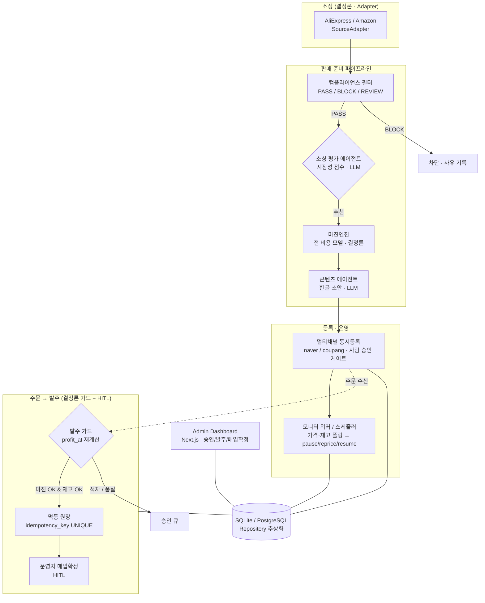

# 직구곰 (jikgugom)

> 🐻 해외(AliExpress·Amazon)에서 상품을 물어와 국내 멀티채널에 푸는 **무재고 구매대행 자동화 플랫폼**. 돈이 오가는 구간은 결정론 코드로, 애매한 판단만 AI 에이전트로.

---

## 🎬 데모

<!-- TODO: 실측값 채우기 — 대시보드 동작 GIF / 스크린샷 / 배포 링크 -->
🚧 **데모 GIF·스크린샷 추가 필요** (어드민 대시보드 승인 버튼·발주 큐·시장성 점수 화면)

키 없이 즉시 전체 흐름을 보고 싶으면 [실행 방법](#-실행-방법) → `python -m jikgugom.demo` 한 줄로 mock 파이프라인이 돈다.

---

## 📌 문제 정의 / 만든 이유

구매대행 자동화에서 가장 위험한 건 **돈을 다루는 코드에 비결정성을 끌어들이는 것**이다.

- 상품은 *과거 가격*에 팔린다. 주문~발주 사이에 원본이 품절되거나 가격이 오르면, 그대로 발주하는 순간 **손실이 확정**된다.
- 같은 주문이 두 번 발주되면 **이중결제**다.
- 그런데 "이 상품이 팔릴까?"(시장성)·"이 CS 문의에 뭐라 답하지?" 같은 건 규칙으로 못 짠다 — 판단의 영역이다.

그래서 시스템을 두 종류의 로직으로 **물리적으로 분리**했다.

| 구간 | 방식 | 이유 |
|---|---|---|
| 소싱·**컴플라이언스 필터·마진계산·발주** | **결정론 코드 (규칙)** | 돈·법적 리스크 구간. 같은 입력 → 같은 결과(재현성). 디버깅·감사 가능 |
| **시장성 평가·콘텐츠 생성·CS 응대** | **LLM 에이전트** | 정답이 없는 판단. 통과분만 처리해 토큰 낭비 차단 |

> **LLM을 금전 판단에서 의도적으로 배제**했다. "팔수록 적자"의 원인은 숨은 비용 누락이지 똑똑하지 못한 모델이 아니다. 마진·발주는 *재현 가능하고 검증 가능한* 코드여야 한다.

이 분리를 코드 레벨에서 보증하는 장치가 두 가지다.
- **컴플라이언스 필터를 평가(LLM) 앞에 배치** — 싼 규칙으로 거른 뒤에만 비싼 LLM을 태운다.
- **발주 직전 결정론 가드(`profit_at` 재계산) + 멱등 원장** — 적자/품절은 사람 승인 큐로, 발주는 멱등키로 한 번만.

---

## 🛠 기술 스택 + 선정 이유

| 분류 | 기술 | 선정 이유 |
|---|---|---|
| Language | Python 3.11+ | 타입힌트 + ABC로 포트-어댑터 계약을 명시 |
| API | **FastAPI** + Uvicorn | 비동기 ASGI, Pydantic 스키마로 입출력 계약. 대시보드 백엔드 |
| ORM/DB | **SQLAlchemy 2.0** + SQLite/PostgreSQL | `Repository` 추상화로 인메모리↔SQL 교체. `DATABASE_URL`만 바꾸면 Postgres |
| 스케줄러 | **APScheduler** | 별도 인프라(Redis/Beat) 없이 인프로세스로 가격·재고 주기 점검 |
| AI | **Google Gemini (REST)** | 평가·콘텐츠·CS 에이전트. REST 직호출이라 추가 SDK 불필요, 키만 있으면 real |
| Frontend | **Next.js** + TypeScript | 어드민 대시보드(승인 큐·발주 큐·매입확정 모달) |
| 인증 | Google OAuth + 세션 JWT | 관리자 화이트리스트 로그인, 라우트 보호 |
| 배포 | Docker Compose | 백+프+SQLite 볼륨 한 묶음 (`DEPLOY.md`) |
| 테스트 | pytest | **194 tests**, 외부 의존 없이 전부 mock으로 실행 |

핵심 선택 3가지:
- **SQLAlchemy + Repository 추상화** → 키 없이도 인메모리로 전체가 돌고, `.env`만 채우면 SQL 영속으로 전환. "외부 의존 없이 동작"이 기본값.
- **Gemini REST 직호출** → SDK 의존성 제거. 키 없는 레이어는 자동으로 mock 유지(graceful degradation).
- **APScheduler 인프로세스** → 포트폴리오 단계에서 Celery+Redis 같은 무거운 인프라 없이 주기 작업 실증.

---

## 🏗 시스템 아키텍처


```mermaid
flowchart TD
    subgraph SRC["소싱 (결정론 · Adapter)"]
        A[AliExpress / Amazon<br/>SourceAdapter]
    end
    subgraph DET["판매 준비 파이프라인"]
        B[컴플라이언스 필터<br/>PASS / BLOCK / REVIEW]
        E{소싱 평가 에이전트<br/>시장성 점수 · LLM}
        M[마진엔진<br/>전 비용 모델 · 결정론]
        C[콘텐츠 에이전트<br/>한글 초안 · LLM]
    end
    subgraph PUB["등록 · 운영"]
        P[멀티채널 동시등록<br/>naver / coupang · 사람 승인 게이트]
        MON[모니터 워커 / 스케줄러<br/>가격·재고 폴링 → pause/reprice/resume]
    end
    subgraph ORD["주문 → 발주 (결정론 가드 + HITL)"]
        G{발주 가드<br/>profit_at 재계산}
        F[멱등 원장<br/>idempotency_key UNIQUE]
        H[운영자 매입확정<br/>HITL]
    end
    DB[(SQLite / PostgreSQL<br/>Repository 추상화)]
    UI[Admin Dashboard<br/>Next.js · 승인/발주/매입확정]

    A --> B
    B -- PASS --> E
    B -- BLOCK --> X[차단 · 사유 기록]
    E -- 추천 --> M --> C --> P
    P --> MON
    P -.주문 수신.-> G
    G -- 마진 OK & 재고 OK --> F --> H
    G -- 적자 / 품절 --> Q[승인 큐]
    P & MON & ORD --- DB
    UI --- DB
```

**데이터 흐름**: 소싱(Adapter) → **컴플라이언스(싼 규칙으로 먼저 거름)** → 평가(LLM, 통과분만) → 마진(전 비용 결정론) → 콘텐츠(LLM) → 멀티채널 등록(사람 승인) → 주문 수신 시 **발주 가드(`profit_at` 재계산)** → 통과만 멱등 원장 기록 → 운영자 매입확정(HITL). 모든 상태는 `Repository`로 추상화된 DB에 영속.

> 설계 청사진 전문은 [`docs/DESIGN.md`](./docs/DESIGN.md), 컴플라이언스 스펙은 [`docs/COMPLIANCE_FILTER.md`](./docs/COMPLIANCE_FILTER.md).

---

## 📊 규모 / 성능 지표

| 항목 | 값 | 근거 |
|---|---|---|
| 테스트 | **194 tests** (전부 mock, 외부 의존 0) | `python -m pytest -q --co` |
| 파이프라인 단계 | 7단계 (소싱→컴플→평가→마진→콘텐츠→등록→모니터·발주) | `pipeline/runner.py`, `docs/DESIGN.md §3` |
| 결정론 vs 에이전트 분리 | 결정론 4 (소싱·컴플·마진·발주) / 에이전트 3 (평가·콘텐츠·CS) | `docs/DESIGN.md §4` |
| 어댑터 | Source 2 (AliExpress·Amazon) + Channel 2 (naver·coupang) | `adapters/`, `pipeline/multichannel.py` |
| 영속화 | SQLite ↔ PostgreSQL 교체 (`Repository` 1줄) | `api/repository.py`, `api/db.py` |

> 처리량·지연시간 등 **측정하지 않은 성능 수치는 기재하지 않는다.** 위 값은 코드/테스트에서 직접 확인 가능한 사실만.

---

## 🔧 트러블슈팅 / 의사결정 기록

**1. LLM 판단의 비결정성이 금전 로직을 오염시킴**
- 문제: 마진·발주를 LLM에 맡기면 같은 입력에 다른 결과 → 재현·감사·디버깅 불가, 손실의 원인 추적 불능.
- 원인: "AI로 다 한다"는 충동. 하지만 돈 구간은 정답이 정해진 *계산*이지 판단이 아님.
- 해결: 돈 구간(소싱·컴플·마진·발주)을 **결정론 코드**로, 판단 구간(평가·콘텐츠·CS)만 **에이전트**로 물리 분리. `MarginEngine`은 YAML 비용 파라미터로 순수 계산.
- 결과: 마진·발주가 재현 가능·테스트 가능. 모듈별 mock으로 194 테스트 전부 외부 의존 없이 실행.

**2. 같은 주문의 이중결제(중복발주) 위험**
- 문제: 재시도·동시요청 시 같은 채널주문이 두 번 발주되면 실제 돈이 두 번 빠짐.
- 원인: 발주가 비가역(돈) 행동인데 "이미 발주했나?"를 기록할 곳이 없음.
- 해결: `FulfillmentLedger`(포트) + `SqlFulfillmentLedger`(어댑터)로 발주 원장을 영속화하고 **`idempotency_key`에 DB UNIQUE 제약**. 멱등키 = `channel_order_no`. 인메모리는 재시작 시 휘발 → 재매입 위험이 있어 SQL 영속으로 마지막 방어선 구성.
- 결과: 같은 주문은 DB가 물리적으로 한 줄만 허용 → 이중결제 차단. `place_order` 재호출은 기존 결과 반환(멱등).

**3. Amazon은 제3자 공개 구매 API가 없음**
- 문제: 발주(실결제)를 어떻게 자동화하나. 브라우저 자동결제는 ToS 위반·취약.
- 원인: 비가역 결제 지점을 무인 자동화하면 사고 시 복구 불가.
- 해결: **반자동(HITL)** — `ManualFulfiller`가 발주 의도를 원장에 `AWAITING_PURCHASE`로 기록(자동), 운영자는 대시보드 매입확정 모달에서 *결제 버튼만* 누름(`POST /api/orders/{id}/confirm` → `PURCHASED`). 기록·추적·멱등은 전부 자동.
- 결과: "돈 구간엔 사람 게이트" 원칙을 지키면서 나머지는 무인. 정직한 자동화.

**4. "키 넣었는데 왜 mock?" / 설정 실수**
- 문제: real 모드 전환이 코드 수정에 묶이면 운영 부담. 네이버 키를 한쪽만 넣는 등 부분 설정은 조용히 깨짐.
- 원인: 설정-코드 결합, 검증 부재.
- 해결: `core/settings.py` + `adapters/factory.py`(Composition Root)가 `.env`만 보고 real/mock 자동 배선. **시작 시 fail-fast 검증**(잘못된 부분 설정 즉시 에러), `GET /api/config`로 레이어별 real/mock **가시화**, 외부 호출은 **지수 백오프 재시도 + 429 Retry-After**, 키는 로그·에러에 **마스킹**.
- 결과: 채운 레이어만 real, 빈 레이어는 mock 유지(graceful degradation). 코드 수정 0.

---

## 🚀 실행 방법

### 레벨 1 — 키 없이 데모/테스트 (즉시)
```bash
pip install -r requirements.txt
python -m jikgugom.demo      # 샘플 카탈로그로 전체 흐름 1회(mock)
python -m pytest -q          # 194 tests
```

### 레벨 2 — 대시보드 (웹 UI)
```bash
python -m uvicorn api.main:app --port 8000 --reload   # 백엔드 (터미널 A)
npm --prefix dashboard install                        # 최초 1회
npm --prefix dashboard run dev                        # 프론트 → http://localhost:3000 (터미널 B)
```
상태는 SQLite 파일(`jikgugom.db`)에 영속. `export DATABASE_URL=postgresql+psycopg://...` 로 Postgres 전환.

### 레벨 3 — Docker 한 묶음 + 실 API
```bash
cp .env.example .env          # 키 채운 레이어만 real (graceful degradation)
docker compose up -d --build  # 프론트 :3000 / 백엔드 :8000
```
Google OAuth 관리자 로그인·환경변수 상세는 [`DEPLOY.md`](./DEPLOY.md) 참조.

---

## 📁 코드 구조 (요약)

```
jikgugom/
├── adapters/     포트-어댑터: SourceAdapter / ChannelAdapter (ABC) + AliExpress·Amazon
├── compliance/   통관·KC·금지어 규제 필터 (PASS/BLOCK/REVIEW), 룰=YAML
├── margin/       전 비용 마진엔진 → 채널 판매가/예상이익
├── monitor/      가격·재고 폴링 → auto-pause/리프라이싱/재개
├── pipeline/     소싱→컴플→마진→[평가]→콘텐츠→등록 오케스트레이션 + 멀티채널 팬아웃
├── evaluation/   시장성 평가 에이전트 (Gemini, mock 폴백)
├── content/      콘텐츠 에이전트 (번역+LLM 초안, Gemini)
├── order/        주문 가드 + 반자동 발주 (멱등 원장)
├── cs/           CS 응대 에이전트 (자동응답 + 에스컬레이션)
└── core/         설정·Gemini REST 클라이언트 (settings.py → real/mock 자동 배선)
api/              FastAPI 대시보드 API + Repository(SQLite/PG) + 스케줄러 + OAuth 인증
dashboard/        Next.js / React 어드민 UI (승인 큐·발주 큐·매입확정 모달)
config/costs.yaml 비용 파라미터 (환율·관세·수수료)
tests/            계약/엔진/에이전트 테스트 (194 passed, 외부 의존 0)
```

상세 설계는 [`docs/DESIGN.md`](./docs/DESIGN.md), 컴플라이언스 스펙은 [`docs/COMPLIANCE_FILTER.md`](./docs/COMPLIANCE_FILTER.md) 참고.

---

## 💡 회고

- **"AI로 다 한다"는 안티패턴이다.** 돈·법규 구간을 결정론으로 가두고 판단만 LLM에 맡기는 분리가, 자동화에서 신뢰성과 검증 가능성을 동시에 얻는 길이라는 걸 코드로 증명했다.
- **외부 의존 없이 전부 도는 게 기본값**이어야 협업·테스트·시연이 쉽다. 포트-어댑터로 real/mock을 같은 계약 뒤에 두니 194 테스트가 키 없이 돌고, `.env` 한 장으로 실서비스로 확장된다.
- 남은 갭: 채널별 모니터(현재 monitor는 naver primary에 키잉)·채널별 카테고리 재매핑·베스트셀러 예측 ML (Phase 4).
